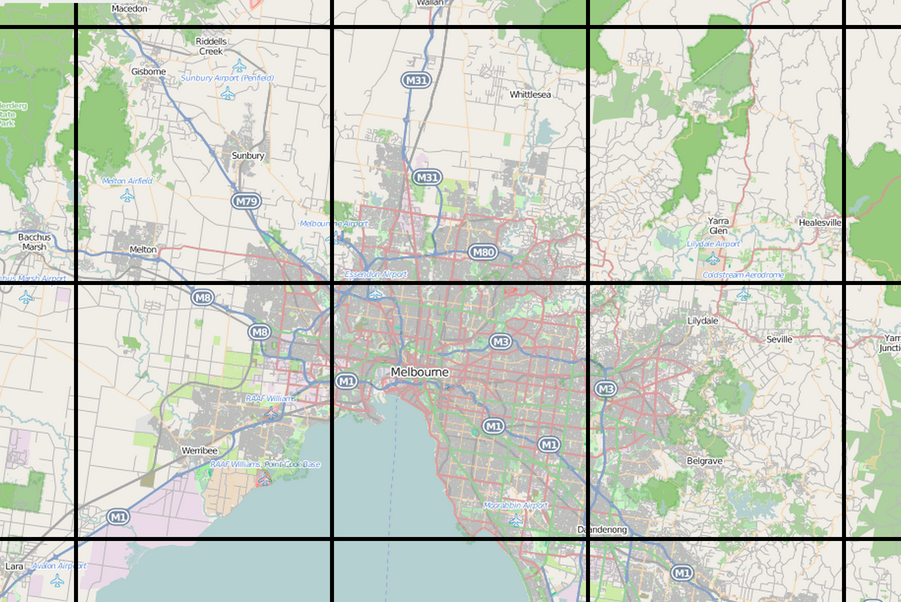

# MEAN.IO (3/3)

Voici le dernier article de la série consacrée à MEAN.IO, après la présentation générale du framework lors du premier et celles des concepts permettant de créer un nouveau module dans le second, nous nous attarderons ici sur un cas d'application concret : celui de la visualisation de données géographiques sous forme de carte ou sous forme 3D. Depuis le départ, nous souhaitons en effet créer une application permettant de visualiser un ou plusieurs itinéraires GPS (type randonnée VTT ou pédestre). Nous avons défini précédemment le modèle de données permettant de stocker l'information en base, ainsi que l'API REST permettant de le manipuler. Ensuite, nous avons créé une partie cliente incluant des interfaces homme-machine (IHM) pour la présentation et l'édition de ces données. Il ne nous reste donc maintenant qu'à visualiser nos chemins sous formes de cartes à la façon de "Google Maps" ou de vues 3D à la façon de "Google Earth".

## Mise à jour de l'application

### Partie serveur (back-end)

#### Mise à jour du modèle

Nous avions défini dans l'article précédent le schéma MongoDB de l'objet unique manipulé par notre application et qui est un itinéraire GPS ('track' en anglais). Un tel chemin est simplement décrit par une liste de positions GPS acquises par le capteur. Chaque point est repéré en coordonnées géographiques : longitude, latitude et altitue. A part l'utilisateur qui l'a créé, un titre et un descriptif, le chemin contenait donc un tableau de ces coordonnées. Afin de localiser plus simplement le chemin sur une carte nous allons rajouter un champ contenant l'étendue géographique, traditionnellement nommé BBox (Bounding Box), car mathématiquement il correspond à la plus petite "boîte" en deux dimensions qui englobe tous les points du chemin. Concrètement ce rectangle est défini par un point sud-ouest contenant la longitude et la latitude minimales et le point nord-est contenant la longitude et la latitude maximales, nous stockerons ces 4 valeurs sous la forme d'un tableau. Ceci nous permettra de recentrer la vue cartographique sur la zone concernée pour ne pas avoir à rechercher sur la carte. Nous rajoutons donc au fichier **TrackModel.js** dans le dossier **models** du module le code suivant pour le schéma et la fonction d'importation des données :
```javascript
'use strict';

// Déclaration du schéma du modèle 'Track'
var TrackSchema = new mongoose.Schema({
  ...
  // Boite englobante des points (coordonnées géographiques également)
  bbox : {
    type : [Number], required : false
  }
});

// Getter permettant de récupérer le chemin au format GeoJSON
TrackSchema.virtual('geojson')
.get(function () {
  ...
})
// Setter permettant de remplir le chemin à partir de données au format GeoJSON
.set(function (geojson) {
  ...
    // Transformation dans le formalisme de la base de données
    var waypoints = [];
    // Calcul de la boite englobante
    var minLon = 360; var maxLon = -360;
    var minLat = 90; var maxLat = -90;
    
    for (var i = 0; i < coordinates.length; i++) {
      waypoints[3*i] = coordinates[i][0];
      waypoints[3*i+1] = coordinates[i][1];
      // Mise à jour des valeurs min/max
      minLon = Math.min(minLon, waypoints[3*i]);
      minLat = Math.min(minLat, waypoints[3*i+1]);
      maxLon = Math.max(maxLon, waypoints[3*i]);
      maxLat = Math.max(maxLat, waypoints[3*i+1]);
      // Nous nous assurons d'avoir des coordonnées 3D
      if ( coordinates[i].length >= 3 ) {
        waypoints[3*i+2] = coordinates[i][2];
      } else {
        waypoints[3*i+2] = 0;
      }
    }
      
    this.set( 'waypoints', waypoints );
    this.set( 'bbox', [minLon, minLat, maxLon, maxLat] );
  }
});
```

### Partie cliente (front-end)

### Mise à jour des routes


## Vue cartographique

La gestion de données cartographiques est un domaine qui nécessite un travail algorithmique important, afin d'assurer des temps d'accès rapides, tant le volume de données peut être conséquent. Imaginez par exemple que l'on couvre aujourd'hui la terre entière avec des images satellite à une résolution de quelques dizaines de centimères. Une telle image sur une zone de 20 kilomètres carrés a une taille qui avoisine le milliard de pixels et pèse plusieurs gigaoctets même compressée. Accéder à une base de données mondiale de ce type nécessite de pouvoir naviguer à travers des dizaines téraoctets de données. Heureusement, des services mettant à disposition de telles données sont aujourd'hui accessibles gratuitement sur internet, comme par exemple [OpenStreetMap](https://www.openstreetmap.org) que nous utiliserons pour nous fournir un fond de carte sur lequel nous viendrons afficher nos tracés GPS.

Concernant la visualisation de données cartographique, les deux librairies Open Source les plus connues sont probablement à ce jour [OpenLayers](http://openlayers.org/) et [Leaflet](http://leafletjs.com/). David Rubert a eu la bonne idée d'initier des projets Open Source (auxquels j'essaye de contribuer) pour encapsuler ces deux librairies via des directives AngularJS, il s'agit de : [angular-openlayers-directive](https://github.com/tombatossals/angular-openlayers-directive) et [angular-leaflet-directive](https://github.com/tombatossals/angular-leaflet-directive). Nous allons utiliser cette dernière pour notre application.

### Directive

### Contrôleur

### Vue



## Vue 3D

### Service

### Directive

### Contrôleur

### Vue


## Conclusion

