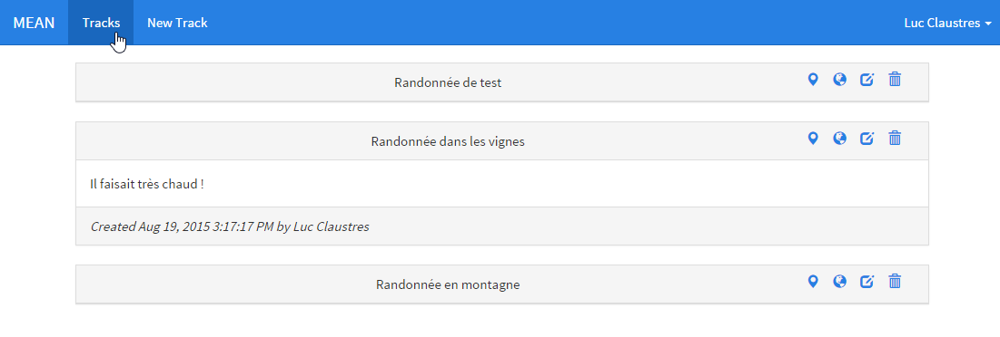
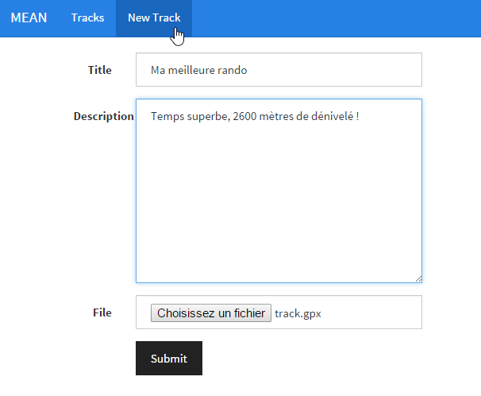
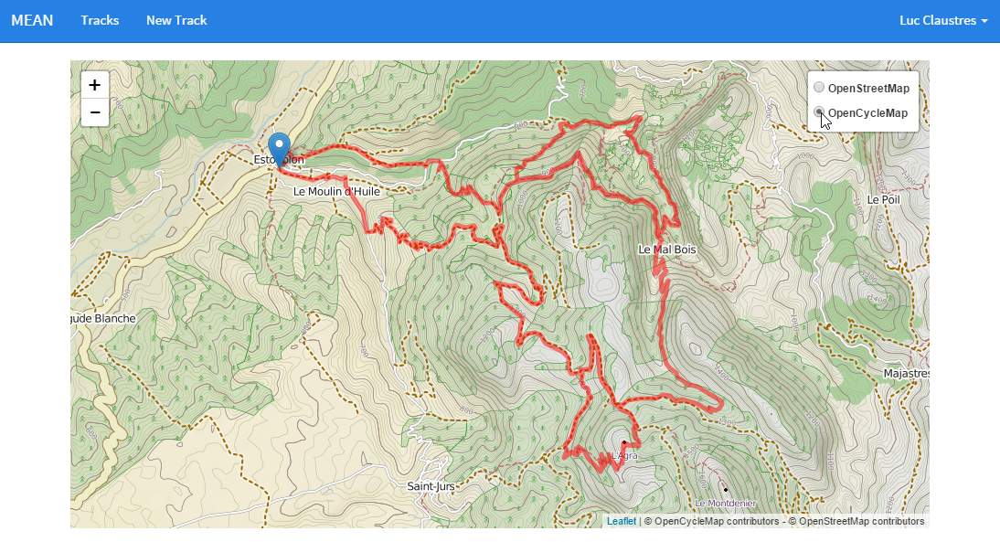

# MEAN.IO (3/3)

Voici le dernier article de la série consacrée à MEAN.IO, après la présentation générale du framework lors du premier et celles des concepts permettant de créer un nouveau module dans le second, nous nous attarderons ici sur un cas d'application concret : celui de la visualisation de données géographiques sous forme de carte ou sous forme 3D. Depuis le départ, nous souhaitons en effet créer une application permettant de visualiser un ou plusieurs itinéraires GPS (type randonnée VTT ou pédestre). Nous avons défini précédemment le modèle de données permettant de stocker l'information en base, ainsi que l'API REST permettant de le manipuler. Ensuite, nous avons créé une partie cliente incluant des interfaces homme-machine (IHM) pour la présentation et l'édition de ces données. Il ne nous reste donc maintenant qu'à visualiser nos chemins sous formes de cartes à la façon de "Google Maps" ou de vues 3D à la façon de "Google Earth".

## Mise à jour de l'application

### Partie serveur (back-end)

#### Mise à jour du modèle

Nous avions défini dans l'article précédent le schéma MongoDB de l'objet unique manipulé par notre application qui est un itinéraire GPS ('track' en anglais). Un tel chemin est simplement décrit par une liste de positions GPS acquises par le capteur. Chaque point est repéré en coordonnées géographiques : longitude, latitude et altitue. A part l'utilisateur qui l'a créé, un titre et un descriptif, le chemin contenait donc un tableau de ces coordonnées. Afin de localiser plus simplement le chemin sur une carte nous allons rajouter un champ contenant l'étendue géographique, traditionnellement nommé BBox (Bounding Box), car mathématiquement il correspond à la plus petite "boîte" en deux dimensions qui englobe tous les points du chemin. Concrètement ce rectangle est défini par un point sud-ouest contenant la longitude et la latitude minimales et un point nord-est contenant la longitude et la latitude maximales, nous stockerons ces 4 valeurs sous la forme d'un tableau. Ceci nous permettra de recentrer la vue cartographique sur la zone concernée pour ne pas avoir à rechercher sur la carte. Nous rajoutons donc au fichier **TrackModel.js** dans le dossier **models** du module le code suivant pour le schéma et la fonction d'importation des données :
```javascript
// Déclaration du schéma du modèle 'Track'
var TrackSchema = new mongoose.Schema({
  ...
  // Boite englobante des points (coordonnées géographiques également)
  bbox : {
    type : [Number], required : false
  }
});

// Getter permettant de récupérer le chemin au format GeoJSON
TrackSchema.virtual('geojson')
.get(function () {
  ...
})
// Setter permettant de remplir le chemin à partir de données au format GeoJSON
.set(function (geojson) {
  ...
    // Transformation dans le formalisme de la base de données
    var waypoints = [];
    // Calcul de la boite englobante
    var minLon = 360; var maxLon = -360;
    var minLat = 90; var maxLat = -90;
    
    for (var i = 0; i < coordinates.length; i++) {
      waypoints[3*i] = coordinates[i][0];
      waypoints[3*i+1] = coordinates[i][1];
      // Mise à jour des valeurs min/max
      minLon = Math.min(minLon, waypoints[3*i]);
      minLat = Math.min(minLat, waypoints[3*i+1]);
      maxLon = Math.max(maxLon, waypoints[3*i]);
      maxLat = Math.max(maxLat, waypoints[3*i+1]);
      // Nous nous assurons d'avoir des coordonnées 3D
      if ( coordinates[i].length >= 3 ) {
        waypoints[3*i+2] = coordinates[i][2];
      } else {
        waypoints[3*i+2] = 0;
      }
    }
      
    this.set( 'waypoints', waypoints );
    this.set( 'bbox', [minLon, minLat, maxLon, maxLat] );
  }
});
```

### Partie cliente (front-end)

#### Mise à jour des routes

Aux routes côté front-end, qui sont gérées via l'[AngularUI Router](https://github.com/angular-ui/ui-router), nous en ajoutons deux nouvelles dans le fichier **ApplicationRoutes.js** du dossier **routes** de la partie publique, il s'agit des déclarations permettant d'accéder aux pages pour afficher la carte ou la vue 3D d'un chemin  :
```javascript
// Definition des routes pour les chemins
angular.module('mean.application').config(['$stateProvider',
  function($stateProvider) {
    // Page permettant de voir un chemin sur la carte
    $stateProvider.state('track map', {
      url: '/track/:trackId/map',
      templateUrl: '/application/views/TrackMap.html',
      controller: 'TrackMapController',
      resolve: {
        loggedin: function(MeanUser) {
          return MeanUser.checkLoggedin();
        }
      }
    })
    // Page permettant de voir un chemin sur le globe
    .state('track globe', {
      url: '/track/:trackId/globe',
      templateUrl: '/application/views/TrackGlobe.html',
      controller: 'TrackGlobeController',
      resolve: {
        loggedin: function(MeanUser) {
          return MeanUser.checkLoggedin();
        }
      }
    });
  }
]);
```

#### Mise à jour des vues

Pour la présentation des chemins (sous forme de liste ou sous forme unitaire) nous avions utilisé précédemment des [panels](http://getbootstrap.com/components/#panels) Bootstrap. L'en-tête (classe CSS *panel-heading*) contenait notamment les actions réalisables par l'utilisateur (e.g. éditer ou effacer) sous forme d'icônes, auxquelles nous rajoutons la possibilité d'ouvrir la vue cartographique ou 3D (Figure 1) dans **public/views/Track.html** :
```html
<!-- Nom du chemin -->
<div class="panel panel-default">
  <!-- Un clic sur l'en-tête provoque l'uverture du corps du panneau -->
  <div class="text-center panel-heading" ng-click="track.isOpen = !track.isOpen">{{track.title}}
    <!-- Actions associés au chemin (effacer, éditer, vue 3D et vue carte) -->
    <a data-ng-click="remove(track); $event.stopPropagation();"><i class="pull-right glyphicon glyphicon-trash" tooltip="Remove track" tooltip-trigger="mouseenter" tooltip-placement="top">&nbsp;</i></a>
    <a href="/track/{{track._id}}/edit"><i class="pull-right glyphicon glyphicon-edit" tooltip="Edit track" tooltip-trigger="mouseenter" tooltip-placement="top">&nbsp;</i></a>
    <a href="/track/{{track._id}}/globe"><i class="pull-right glyphicon glyphicon-globe" tooltip="View 3D track" tooltip-trigger="mouseenter" tooltip-placement="top">&nbsp;</i></a>
    <a href="/track/{{track._id}}/map"><i class="pull-right glyphicon glyphicon-map-marker" tooltip="View track map" tooltip-trigger="mouseenter" tooltip-placement="top">&nbsp;</i></a>
  </div>
  <!-- Description du chemin -->
  <div collapse="!track.isOpen">
    <div class="panel-body">
      {{track.description}}
    </div>
    <!-- Date/auteur du chemin -->
    <div class="panel-footer">
      <em >Created {{track.created | date:'medium'}} by {{track.user.name}}</em>
    </div>
  </div>
</div>
```



Pour rappel le formulaire de création ou d'édition d'un chemin (Figure 2) défini dans **public/views/TrackEditor.html** permet d'ingérer un itinéraire GPS au format KML ou GPX via la sélection d'un fichier. Par souci de simplicité le fichier est directement lu par l'application côté client et le contenu passé dans la requête HTTP, ce qui pose problème sur des fichiers "normaux" car par défaut Express configure une limite de 100 Kb pour la charge utile des requêtes JSON (voir https://github.com/expressjs/body-parser).

> **Trucs & Astuces** : Je vous conseille d'utiliser de petits fichiers avec cette application au risque de voir fleurir des erreurs HTTP 500 lors de la création ou de la mise à jour d'un chemin (message Express `Error: request entity too large`). Vous pouvez également configurer la taille par défaut via une instruction du type `app.use(express.json({limit: '50mb'}));` à l'initialisation d'Express. Néanmoins aujourd'hui il vous sera nécessaire de modifier directement le code de MEAN.IO pour se faire car cette option n'a pas encore été prévue dans les fichiers de configuration (voir le fichier **ExpressEngine.js** dans le module node *meanio*). Vous pouvez également utiliser des outils dédiés tels que le package MEAN.IO [upload](http://mean.io/#!/packages/53ccd40e56eac633a3eee335) ou [ng-file-upload](https://github.com/danialfarid/ng-file-upload) couplés à [multer](https://github.com/expressjs/multer) qui se basent sur les *Form Data* pour disposer d'un transfert de fichier fiable.



## Vue cartographique

La gestion de données cartographiques est un domaine qui nécessite un travail algorithmique important, afin d'assurer des temps d'accès rapides, tant le volume de données peut être conséquent. Imaginez par exemple que l'on couvre aujourd'hui la terre entière avec des images satellite à une résolution de quelques dizaines de centimères. Une telle image sur une zone de 20 kilomètres carrés a une taille qui avoisine le milliard de pixels et pèse plusieurs gigaoctets même compressée. Accéder à une base de données mondiale de ce type nécessite de pouvoir naviguer à travers des dizaines téraoctets de données. Heureusement, des services mettant à disposition de telles données sont aujourd'hui accessibles gratuitement sur internet, comme par exemple [OpenStreetMap](https://www.openstreetmap.org) que nous utiliserons pour nous fournir un fond de carte sur lequel nous viendrons afficher nos tracés GPS.

Les fonds de carte de ce type sont généralement découpées en tuiles (i.e. images) de petite taille et décomposés sur plusieurs niveaux géographiques (échelles ou niveaux de résolution). L'idée générale pour obtenir un affichage fluide est, en fonction de la zone visualisée par l'utilisateur, d'identifier et de télécharger uniquement les tuiles visibles et dont la résolution est la plus adaptée à l'écran. Les tuiles présentent en général un grand nombre de niveaux de zoom, de la vue mondiale au détail de la rue, mais leur nombre à l'écran dépasse rarement quelques dizaines (Figure 3).

")

Pour la visualisation de données cartographique, les deux librairies Open Source les plus connues sont probablement à ce jour [OpenLayers](http://openlayers.org/) et [Leaflet](http://leafletjs.com/). David Rubert a eu la bonne idée d'initier des projets Open Source (auxquels j'essaye de contribuer) pour encapsuler ces deux librairies via des directives AngularJS, il s'agit de : [angular-openlayers-directive](https://github.com/tombatossals/angular-openlayers-directive) et [angular-leaflet-directive](https://github.com/tombatossals/angular-leaflet-directive). Nous allons utiliser cette dernière pour notre application. 

### Directive

Pour ce faire il faut rajouter `"angular-leaflet-directive": "latest"` dans le fichier `bower.json` à la racine de votre dossier applicatif et exécuter `bower install`. Ensuite il faut modifier le **app.js** du module applicatif pour rajouter les fichiers nécessaires à l'aggrégation (voir article précédent) :
```javascript
// Dépendances AngularJS du module
Application.angularDependencies(['mean.system', 'mean.users', 'leaflet-directive']);
Application.aggregateAsset('css', '../../../../../../bower_components/leaflet/dist/leaflet.css');
// La priorité permet de s'assurer que la librairie est chargée avant la directive
Application.aggregateAsset('js', '../../../../../../bower_components/leaflet/dist/leaflet.js', {weight: -1});
Application.aggregateAsset('js', '../../../../../../bower_components/angular-leaflet-directive/dist/angular-leaflet-directive.js');
```

La directive se configure principalement via les attributs suivants :

 * **defaults** : objet définissant la configuration de la carte (e.g. contrôles actifs)
 * **center** : objet contenant les coordonnées du point central par défaut ainsi que le niveau de zoom
 * **layers** : liste des couchesdisponibles pour le fond cartographique
 * **markers** : liste de marqueurs (i.e. icônes) disposés sur la carte
 * **geojson** : une couche de données au format GeoJSON affichée en surimpression sur la carte

Notre configuration se contente d'autoriser le zoom avant/arrière via la molette et d'afficher également des boutons +/- pour se faire :
```javascript
$scope.defaults = {
  zoomControlPosition: 'topleft',
  scrollWheelZoom: true
}
```
Chaque couche est caractérisée par un nom, un type (i.e. format) et une URL d'accès aux données. Les différentes couches de fond cartographique sont sélectionnables via un menu intégré à la carte (en haut à droite Figure 4). Par exemple la couche de base proposée par OpenStreetMap est configuré comme suit :
```javascript
$scope.layers = { 
  baselayers: [{
    name: 'OpenStreetMap',
    type: 'xyz',
    url: 'http://{s}.tile.openstreetmap.org/{z}/{x}/{y}.png',
    layerOptions: {
        subdomains: ['a', 'b', 'c'],
        attribution: '© OpenStreetMap contributors',
        continuousWorld: true
  }]
}
```
Nous utiliserons la couche des marqueurs pour ajouter un simple marqueur indiquant le point de départ du chemin en indiquant ses coordonnées et un message apparaissant sous forme de bulle d'information : 
```javascript
$scope.markers.you = {
  lat: track.waypoints[1],
  lng: track.waypoints[0],
  message: "You are here"
}
```

### Contrôleur

Le contrôleur de la vue cartographique récupère tout d'abord l'ID du chemin à visualiser dans l'URL grâce à la fonction `findOne()`. Ensuite il configure la couche de données au format GeoJSON à partir du résultat de la requête dédiée sur notre API (voir article précédent). La dernière instruction permet de recentrer la carte sur l'étendue géographique du chemin afin d'obtenir le résultat de la Figure 4 :
```javascript
// Contrôleur utilisé pour afficher un chemin sur une carte
angular.module('mean.application').controller('TrackMapController', ['$scope', '$http', '$stateParams', 'TrackService', 'leafletData',
  function($scope, $http, $stateParams, TrackService, leafletData) {
    
    // Données chargées de façon aynchrone
    $scope.geoJSON = {};
    $scope.markers = {};

    //Récupère un chemin via son ID
    $scope.findOne = function() {
      TrackService.get({
        trackId: $stateParams.trackId
      }, function(track) {
        $scope.track = track;
        // Récupération des données au format GeoJSON
        $http.get('/api/track.GeoJSON/' + track._id).success(function(data, status) {
            angular.extend($scope, {
                geoJSON: {
                    data: data,
                    style: {
                        weight: 5,
                        color: 'red'
                    }
                }
            });
        });
        leafletData.getMap().then(function(map) {
          // Zoom sur le chemin
          map.fitBounds( [ [track.bbox[1], track.bbox[0]], [track.bbox[3], track.bbox[2]] ] );
        });
      });
    };
  }
]);
```

### Vue

La vue se contente d'instancier la directive et de binder les variables appropriés du scope sur les attributs dédiés :
```html
<div data-ng-init="findOne()">
  <!-- Ajout d'une carte Leaflet -->
  <leaflet center="center" layers="layers" geojson="geoJSON" defaults="defaults" markers="markers" width="100%" height="512px"/>  
</div>
```



## Vue 3D

Plusieurs librairies Open Source permettent de visualiser des données géographiques sur un globe virtuel 3D comme [GlobWeb](https://github.com/TPZF/GlobWeb) ou [WebGLEarth](https://github.com/webglearth/webglearth2) mais j'ai choisi d'utiliser [Cesium](http://cesiumjs.org/) pour sa large communauté et sa simplicité (en version 1.5 lors du codage). Pour ce faire il faut rajouter `"cesium": "1.5"` dans le fichier `bower.json` à la racine de votre dossier applicatif et exécuter `bower install`. Ensuite il faudra vous rendre dans le dossier d'installation et exécuter `ant` pour générer la version minifiée des sources. Ensuite il faut modifier le **app.js** du module applicatif pour rajouter les fichiers nécessaires à l'aggrégation (voir article précédent) :
```javascript
Application.aggregateAsset('css', '../../../../../../bower_components/cesium/Build/CesiumUnminified/Widgets/widgets.css');
Application.aggregateAsset('js', '../../../../../../bower_components/cesium/Build/CesiumUnminified/Cesium.js', {weight: -1});
```

### Services

Cesium étant une librairie JavaScript "standard" je l'ai tout d'abord encapsulé dans un service afin de pouvoir l'injecter dans d'autres composants AngularJS. Ceci permet de conserver une injection de dépendance à la mode AngularJS sans accéder de façon directe à un objet global:

```javascript
// Service utilisé pour accéder à la librairie Cesium via l'injection de dépendances
angular.module('mean.application').factory('Cesium', [ function() {
    return window.Cesium; // Assume que la librairie est déjà chargée dans la page
  }
]);
```

Ensuite, j'ai créé un service dédié à la création du chemin suivi en 3D. En effet, pour représenter une animation 3D Cesium se base sur un format interne nommé [CZML](https://github.com/AnalyticalGraphicsInc/cesium/wiki/CZML-Guide) qu'il nous faura donc générer. De plus, il faut pouvoir convertir le chemin depuis le système géodésique utilisé par le GPS vers un repère 3D utilisé par Cesium, en préambule je vous propose de découvrir ces différents systèmes de coordonnées qui devront être manipulés.

#### Systèmes de coordonnées

Afin de positionner un objet sur la Terre il est nécessaire de lui attribuer des coordonnées dans un repère lié à la Terre. Un tel repère doit donc être défini, et le cas échéant complété d'une représentation de la Terre, pour qu'une action de positionnement puisse être menée. Il existe aujourd'hui un grand nombre de systèmes de référence de coordonnées dont je présenterai les deux principaux.

##### Système de coordonnées cartésiennes

Un système de référence terrestre (SRT) est un repère cartésien tridimensionnel (OXYZ) que l’on positionne par rapport à la Terre de telle sorte que :

 * l’origine O est le gravité de la Terre ;
 * l’axe OZ est l’axe de rotation de la Terre ;
 * le plane OXZ est le plan méridien origine ;
 * le plan OXY est le plan de l’équateur.

Un point de la croûte terrestre est considéré comme fixe dans un tel système car le repère "tourne" en même temps que la Terre. Il est repéré par ses coordonnées cartésiennes géocentriques tridimensionnelles : X, Y, Z. Un SRT est également appelé Système de Référence Géodésique ou encore "Earth-Centered, Earth-Fixed" (ECEF).

##### Système de coordonnées géodésiques

Comme il est relativement complexe de repérer un point sur Terre via ses coordonnées cartésiennes, est associé à un SRT un ellipsoïde de révolution qui est un modèle mathématique de la Terre débarrassée de ses reliefs. Il s’agit approximativement d’une sphère aplatie aux pôles qui est une simplification du géoïde : la surface équipotentielle de référence du champ de pesanteur terrestre. Dans un système géodésique ainsi défini, un point est localisé par ses coordonnées géographiques (ou géodésiques), exprimées en valeurs angulaires par la latitude, la longitude, et la hauteur géodésique h mesurée suivant la normale à l'ellipsoïde (h est petit à proximité de la surface terrestre). Le système géodésique le plus utilisé dans le monde est le système WGS 84, associé au système de positionnement GPS.

 avec son plan tangent local (à gauche), système de coordonnées géodésique (à droite) et différence entre ellipsoïde (à gauche) et géoïde (à droite)")

#### Génération du chemin en 3D

Dans Cesium une position en système de coordonnées géodésique est un objet de type `Cesium.Cartographic` et une position 3D un objet de type `Cesium.Cartesian3`. Nous écrivons dans notre service une première fonction permettant de transformer notre chemin stocké en base au format géographique vers un chemin en coordonnées 3D, la transformation aura lieu "en place" puisque chaque point possède trois coordonnées quelque soit le système (X, Y et Z ou longitude, latitude et altitude) :

```javascript
// Service utilisé pour accéder à l'API REST des chemins
angular.module('mean.application').factory('TrackGenerator', ['Cesium',
function (Cesium) {
  // Conversion depuis tableau de coordonnées géographiques vers cartésiennes
  TrackGenerator.cartographicToCartesian = function(waypoints) {
	for (var i = 0; i < waypoints.length / 3; i++) {
		var cartographicPosition = Cesium.Cartographic.fromDegrees(waypoints[3*i], waypoints[3*i+1], waypoints[3*i+2]);
		var position = new Cesium.Cartesian3();
		Cesium.Ellipsoid.WGS84.cartographicToCartesian(cartographicPosition, position);
	
		waypoints[3*i] = position.x;
		waypoints[3*i+1] = position.y;
		waypoints[3*i+2] = position.z;
	}
}
}]);
```  

Ensuite nous ajoutons une nouvelle fonction qui utilisera la première et génèrera l'animation 3D au format CZML à partir du chemin. La partie délicate consiste à affecter à chaque point du chemin un temps pour créer une animation qui soit réaliste. En effet, le GPS échantillonne la position à une fréquence fixe (par exemple un point toutes les 5 secondes) et il manque donc de l'information entre deux points d'échantillonnage pour avoir un mouvement continue. Pour éviter d'obtenir des "sauts" entre les positions lors de la visulisation 3D (ce qui semblerait peu réaliste) la position entre deux échantillons est "interpolée". L'interpolation numérique est une opération mathématique permettant de construire une courbe continue à partir d'un nombre fini de points. Cesium supporte plusieurs types d'interpolation allant de la plus simple qui est l'interpolation linéaire (la trajectoire entre deux points est supposée être une ligne droite) à des formes plus complexes telles que [l'interpolation Lagrangienne](https://fr.wikipedia.org/wiki/Interpolation_lagrangienne) que j'utilise et qui est basée sur un calcul polynômial permettant de représenter un mouvement de façon plus réaliste. Nous supposons une vitesse de base de 90 km/h pour rejouer l'animation dans un temps "raisonnable", le parcous réel pouvant avoir pris plusieurs heures. Dans l'animation 3D nous définissons une entité (i.e. le "véhicule") qui suivra le chemin ainsi créé et l'icone d'un véhicule pour représenter notre position, le code de production du CZML est le suivant :

```javascript
// Génère une animation 3D au format CZML à partir d'un chemin en coordonnées cartographiques
  TrackGenerator.generateCzml = function(waypoints) {
	// La scène CZML contient :
	// - l'icône qui représentera le véhicule (nommé 'VehicleIcon')
	// - le chemin suivi par le véhicule et utilisé pour interpoler sa position (nommé 'Vehicle')
	// Le chemin est donné comme un tableau de coordonnées cartographiques, donc sans référence par rapport au sol (i.e. altitude).
	// La position réelle au niveau du sol sera calculée en temps-réel lors de l'animation.
	var builtInCzml = [ ... ]; // Voir code complet pour détails
	
	var cartesianRoute = waypoints.slice();
	this.cartographicToCartesian( cartesianRoute );
	
	// Définit la date et l'heure de départ
	var epoch = Cesium.JulianDate.now();
	var previousPosition;
	var timeStep = 0;
	
	// L'animation 3D est définie sous la forme d'une liste de temps/position
	for (var i = 0; i < waypoints.length / 3; i++) {
		var position = new Cesium.Cartesian3(cartesianRoute[3*i], cartesianRoute[3*i+1], cartesianRoute[3*i+2]);
		
		if ( Cesium.defined( previousPosition ) )
		{
			var distance = Cesium.Cartesian3.distance(previousPosition, position);
			// Calcul du pas de temps, on considère une vitesse de 90 km/h soit environ 25 m/s
			timeStep += distance / 25;
		}
		// Pas de temps
		builtInCzml[2].position.cartesian[4*i] = timeStep;
		// Position
		builtInCzml[2].position.cartesian[4*i+1] = position.x;
		builtInCzml[2].position.cartesian[4*i+2] = position.y;
		builtInCzml[2].position.cartesian[4*i+3] = position.z;
		
		previousPosition = position;
	}
	
	// Calcul de la date et l'heure de fin
	var end = new Cesium.JulianDate();
	Cesium.JulianDate.addSeconds(epoch, timeStep, end);
	var timeInterval = new Cesium.TimeInterval({
		start : epoch,
		stop : end,
		isStartTimeIncluded : true,
		isStopTimeIncluded : true
	});
	builtInCzml[2].position.epoch = epoch.toString();
	builtInCzml[2].availability = timeInterval.toString();
	
	return builtInCzml;
};
``` 

### Directive

Il n'existe pas de directive AngularJS réellement "officielle", j'ai donc créé une directive permettant d'instancier une vue 3D Cesium sur un élément HTML (on parle de *Viewer*). Elle configure par défaut une couche de données image et une couche topographique pour disposer d'un terrain en 3D, l'ensemble des options possibles est détaillé sur https://cesiumjs.org/Cesium/Build/Documentation/Viewer.html. Enfin, elle rajoute au scope une propriété `viewer` qui référence l'instance Cesium de la vue 3D et permet d'accéder au contenu 3D dans `viewer.scene` comme le point vue courant `viewer.scene.camera` ou le globe virtuel 3D `viewer.scene.globe` : 

```javascript
directive("cesium", ['Cesium', function (Cesium) {
  return {
    restrict: "E",
    controllerAs: "TrackGlobeController",
    link: function (scope, element, attributes) {
      var options = {
        sceneMode : Cesium.SceneMode.SCENE3D,
        sceneModePicker : false,
        scene3DOnly : true,
        homeButton : false,
        geocoder : false,
        navigationHelpButton : true,
        baseLayerPicker : false
      }
      scope.viewer = new Cesium.Viewer(element[0], options);
      // Définition des fournisseurs de données image/terrain à utiliser
      scope.viewer.imageProvider = new Cesium.BingMapsImageryProvider({
          url : '//dev.virtualearth.net'
      });
      scope.viewer.terrainProvider = new Cesium.CesiumTerrainProvider({
          url : '//assets.agi.com/stk-terrain/world'
      });
    }
  }
}]);
```

### Contrôleur

Le contrôleur permet la mise en musique du service back-end et des éléments front-end :
1. récupération du chemin suivi via l'API REST (de façon similaire à la carte 2D du précédent article)
2. génération de l'animation 3D au format CZML
3. chargement de l'animation 3D dans Cesium
4. exécution de l'animation 3D

```javascript
// Contrôleur utilisé pour afficher un chemin sur un globe 3D
angular.module('mean.application').controller('TrackGlobeController', ['$scope', '$http', '$stateParams', 'TrackService', 'TrackGenerator',
  function($scope, $http, $stateParams, TrackService, TrackGenerator) {
    // Projète au sol la position donnée
    var clampToGround = function(position) {
      // Position au sol à altitude 0
      var cartographicPosition = new Cesium.Cartographic();
      Cesium.Ellipsoid.WGS84.cartesianToCartographic(position, cartographicPosition);
      // Origine du rayon à la même position mais au-dessus de tous les sommets existants
      var cartographicOrigin = Cesium.Cartographic.clone(cartographicPosition);
      cartographicOrigin.height = 20000; // Everest ~8000m
      // Calcul du point 3D origine
      var origin = new Cesium.Cartesian3();
      Cesium.Ellipsoid.WGS84.cartographicToCartesian(cartographicOrigin, origin);
      // Calcul de la direction du rayon : de l'origine vers le centre de la Terre
      var direction = new Cesium.Cartesian3();
      Cesium.Cartesian3.subtract(position, origin, direction);
      Cesium.Cartesian3.normalize(direction, direction);
      var ray = new Cesium.Ray(origin, direction);
      
      var groundPosition = new Cesium.Cartesian3();
      // Intersection avec le sol
      return $scope.viewer.scene.globe.pick(ray, $scope.viewer.scene, groundPosition);
    }

    var getTrackedEntity = function() {
      if (Cesium.defined($scope.lookAt)) {
        $scope.trackedEntity = $scope.viewer.dataSources.get(0).entities.getById($scope.lookAt);
        if (Cesium.defined($scope.trackedEntity)) {
          // Vitesse de défilement par défaut
          $scope.viewer.clock.multiplier = 1;
          // Récupérer l'icône représentant l'entité
          $scope.trackedEntityIcon = $scope.viewer.dataSources.get(0).entities.getById($scope.lookAt + 'Icon');
        }
      }
    }

    // Charger l'objet source au format Czml
    // L'argument lookAt est le nom de l'entité à suivre dans les données source
    var loadSource = function(source, lookAt) {
      $scope.lookAt = lookAt;
      // Chargement de l'animation 3D
      var dataSource = new Cesium.CzmlDataSource();
      dataSource.load(source, 'Built-in CZML');
      $scope.viewer.dataSources.add(dataSource);
      // Récupération de l'entité suivant le chemin
      getTrackedEntity();
      // Positionnement du callback appelé à chaque pas d'exécution de l'animation
      $scope.viewer.clock.onTick.addEventListener(function(clock) {
        if ( Cesium.defined($scope.trackedEntity) ) {
          // Récupération de la position courante
          var cartographicPosition = new Cesium.Cartographic();
          var position = $scope.trackedEntity.position.getValue(clock.currentTime);
          Cesium.Ellipsoid.WGS84.cartesianToCartographic(position, cartographicPosition);
          
          // Calcul de la position projetée au sol
          var groundPosition = clampToGround(position);
          if ( Cesium.defined(groundPosition) ) {
            // Mise à jour de la position 3D en conséquence
            position = groundPosition;
            Cesium.Ellipsoid.WGS84.cartesianToCartographic(groundPosition, cartographicPosition);
            // Et positionnement de l'icone 
            if ( Cesium.defined($scope.trackedEntityIcon) ) {
              $scope.trackedEntityIcon.position = new Cesium.ConstantPositionProperty(groundPosition, Cesium.ReferenceFrame.FIXED);
              var text = cartographicPosition.height.toFixed() + ' m';
              $scope.trackedEntityIcon._label._text = new Cesium.ConstantProperty(text);
            }
          }
          
          // Calcul du repère local à la position
          var transform = Cesium.Transforms.eastNorthUpToFixedFrame(position);
          // Attachement du point de vue à ce repère
          Cesium.Matrix4.clone(transform, $scope.viewer.scene.camera.transform);
          $scope.viewer.scene.camera.constrainedAxis = Cesium.Cartesian3.UNIT_Z;
        }
      });
    }

    //Récupère un chemin via son ID
    $scope.findOne = function() {
      TrackService.get({
        trackId: $stateParams.trackId
      }, function(track) {
        $scope.track = track;

        // Position par défaut de la caméra
        $scope.viewer.scene.camera.lookAt(
          new Cesium.Cartesian3(-1500.0, -1500.0, 500.0),
          Cesium.Cartesian3.ZERO,
          Cesium.Cartesian3.UNIT_Z);
        loadSource( TrackGenerator.generateCzml($scope.track.waypoints), "Vehicle");
      });
    };
  }
]);
```

### Vue

La vue est la partie la plus simple car elle se contente d'instancier la directive et de requêter le chemin en faisant appel au contrôleur :
```html
<div data-ng-init="findOne()">
  <!-- Ajout d'un globe 3D -->
  <cesium/>  
</div>
```


## Conclusion

